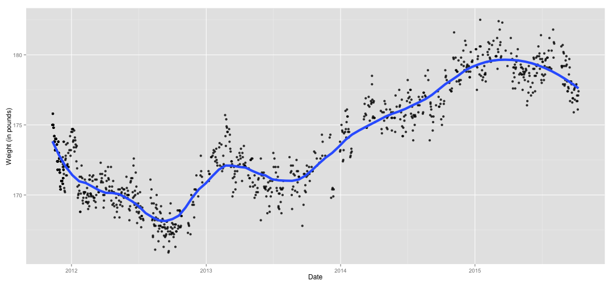

DDP : Project 
========================================================
author: Chris Volinsky
date: December 20, 2015
transition: zoom

Data
========================================================

My Project involves data that I collected on myself as part of the [My Year of Data](myyearofdata.wordpress.com) project.  Basically this was a one year experiment to collect data about myself, back in 2012. 

- Daily Weight data collected from a Withings Scale
- Four years of data! 
- Some days have duplicate or multiple data points

Shiny implementation
========================================================

I used Shiny to create a time series plot of the data.

Widgets include:
- Start Time
- End Time
- Slider for span parameter of "loess" function

I used ggplot2 to create the time series plot, and the *stat.smooth()* option to implement the smoother

Data Facts
========================

The data exists in the Github repository in the file LatestWeight.csv.  Here is the code I used to read it in:


```r
library(lubridate)

datafile="LatestWeight.csv"  
weight=read.csv(datafile,header=T)
names(weight)=c("ts","weight","fat","lean","comments")
weight$ts = parse_date_time(weight$ts,"%Y-%m-%d %H:%M %p")
```

The earliest date in the file is 2011-11-10.  
The latest date in the file is 2015-10-09.  
The average weight in the file is 173.5.  


Weight Plot
========================================================

Here is a plot of all of the data:


 

During the year I was tracking my data (2012), my weight fell.  Since then, however it has been a steady climb! 
